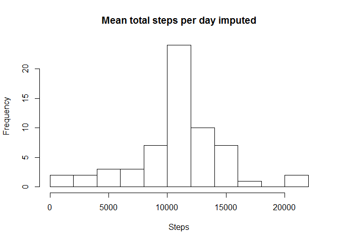

# Course 5 week 2 peer assignment
##Course 5 week 2

###Loading and preprocessing the data
This assumes the file **activity.csv** to be present in the working directory.  
Furthermore the interval is made a factor and the date a real date.

```r
activities <- read.csv("activity.csv",stringsAsFactors = FALSE)
activities$date <- as.Date(activities$date)
activities$interval <- as.factor(activities$interval)
```

###What is mean total number of steps taken per day?
A histogram of the mean total number of steps per day is shown.  
Next the mean and median steps per day are shown.

```r
steps.per.day <- aggregate(activities$steps,by=list(activities$date),sum)
names(steps.per.day) <- c("Date","Total")
hist(steps.per.day$Total,main="Mean total steps per day",
                      ,breaks=10,xlab="Steps",ylab="Frequency")
```

<!-- -->

```r
steps.per.day.mean <- mean(steps.per.day$Total,na.rm=TRUE)
steps.per.day.median <- median(steps.per.day$Total,na.rm=TRUE)
```
Mean steps per day: 10766.19  
Median steps per day: 10765

###What is the average daily activity pattern?
For each of the 288 timesof day of 5 minutes the average number of steps is calculated.  
Finally the time of day with the most activity is reported

```r
steps.per.interval <- aggregate(activities$steps,
                                by=list(activities$interval),
                                mean,na.rm=TRUE)
names(steps.per.interval) <- c("Interval","Mean")
with(steps.per.interval,plot(as.numeric(as.character(Interval)),Mean,type="l",
                             xaxt="n",
                             main="Average daily activity pattern",
                             xlab="Time of day",ylab="Average number of steps"))
axis(side=1,at=seq(0,2400,by=300))
```

<!-- -->

```r
print(paste("time of day with highest average number of steps: ",
            steps.per.interval[which.max(steps.per.interval$Mean),1]))
```

```
## [1] "time of day with highest average number of steps:  835"
```

###Imputing missing values
How many observations are missing?  
Impute the missing values by taking the average (mean) for that interval of the day.

```r
print(paste("Number of missing values: ",sum(is.na(activities$steps))))
```

```
## [1] "Number of missing values:  2304"
```

```r
activities.imputed <- activities
activities.imputed[is.na(activities.imputed$steps),]$steps <- 
  steps.per.interval[activities.imputed
    [is.na(activities.imputed$steps),]$interval,]$Mean
steps.per.day.imputed <- 
  aggregate(activities.imputed$steps,by=list(activities.imputed$date),sum)
names(steps.per.day.imputed) <- c("Date","Total")
hist(steps.per.day.imputed$Total,main="Mean total steps per day imputed",
                      ,breaks=10,xlab="Steps",ylab="Frequency")
```

<!-- -->

```r
steps.per.day.imputed.mean <- mean(steps.per.day.imputed$Total,na.rm=TRUE)
steps.per.day.imputed.median <- median(steps.per.day.imputed$Total,na.rm=TRUE)
```
Mean steps per day: 10766.19  
Median steps per day: 1.0766189\times 10^{4}    
After imputing days with NA's have a value in the plot now too.  
The mean after imputing does not differ from the mean without imputing.  
But the median after imputing is now equal to the mean. Without imputing
the mean was higher than the median.  
  
###Are there differences in activity patterns between weekdays and weekends?


```r
library(lattice)
```

```
## Warning: package 'lattice' was built under R version 3.3.3
```

```r
activities.imputed$day <- weekdays(activities.imputed$date)
activities.imputed$day[activities.imputed$day
                         %in% c("zaterdag","zondag")] <- "weekend"
activities.imputed$day[activities.imputed$day != "weekend"] <- "weekday"
steps.per.interval.day <- 
  aggregate(activities.imputed$steps,
            by=list(activities.imputed$interval,activities.imputed$day),
            mean)
names(steps.per.interval.day) = c("interval","day","mean")
xyplot(mean ~ as.numeric(as.character(interval))|day,
       data=steps.per.interval.day, type="l",
       layout=c(1,2),xlab="Time of day",ylab="Average number of steps",
       scales=list(x=list(at=seq(0,2400,by=300),labels=seq(0,2400,by=300))))
```

<!-- -->
  
There are differences between weekend and workdays:  
Activity in the weekend is more spread over the day where at workdays it is concentrated before 9.
